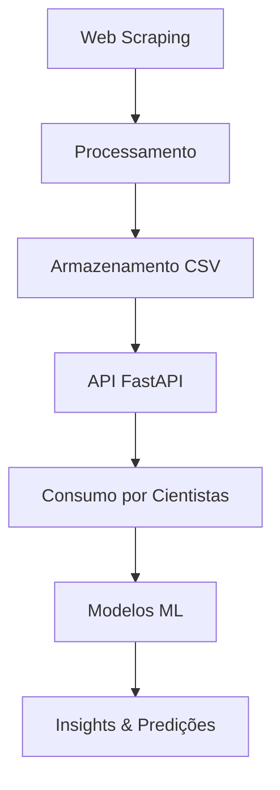
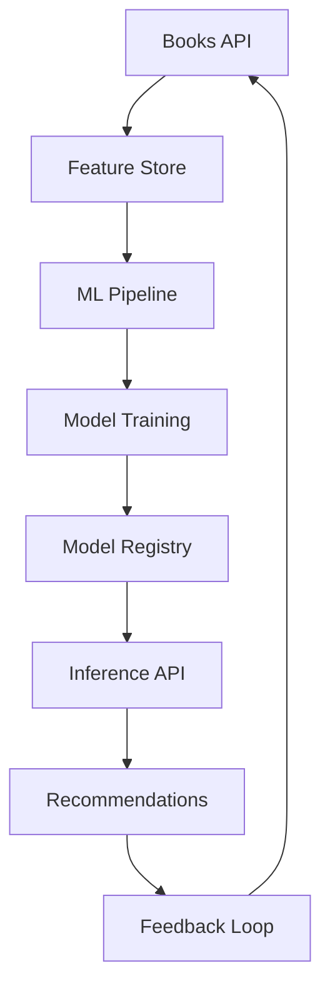

# Plano Arquitetural - Books API

## Visão Geral

Este documento detalha a arquitetura do sistema de consulta de livros, incluindo o pipeline de dados, estratégias de escalabilidade e integração com modelos de Machine Learning.

## Arquitetura do Sistema

### Pipeline de Dados



## 1. Pipeline: Ingestão → Processamento → API → Consumo

### 1.1 Ingestão de Dados

**Componente**: Web Scraper (`scripts/scraper.py`)

**Responsabilidades**:
- Extração automatizada de dados do site books.toscrape.com
- Tratamento de erros HTTP (404, timeouts)
- Controle de rate limiting para evitar sobrecarga
- Validação de dados extraídos

**Tecnologias**:
- `requests` + `BeautifulSoup4` para scraping
- `pandas` para estruturação inicial
- Tratamento robusto de exceções

**Frequência**: Sob demanda ou agendamento (cron jobs)

### 1.2 Processamento de Dados

**Transformações Aplicadas**:
- Limpeza de títulos e categorias
- Normalização de preços (conversão para float)
- Padronização de ratings (1-5 escala)
- Validação de URLs de imagens
- Geração de IDs únicos

**Qualidade dos Dados**:
- Validação de campos obrigatórios
- Detecção de duplicatas
- Tratamento de valores nulos
- Consistência de formatos

### 1.3 Armazenamento

**Atual**: CSV (`data/books_data.csv`)
- Formato estruturado e legível
- Compatível com ferramentas de análise
- Fácil versionamento

**Futuro** (Escalabilidade):
- PostgreSQL para dados relacionais
- Redis para cache de consultas frequentes
- Elasticsearch para busca textual avançada

### 1.4 API de Consumo

**Framework**: FastAPI
- Auto-documentação com Swagger/OpenAPI
- Validação automática com Pydantic
- Performance assíncrona
- Tipagem estática

**Endpoints Estratégicos**:
- `/api/v1/books` - Listagem paginada
- `/api/v1/books/search` - Busca inteligente
- `/api/v1/stats/*` - Dados agregados para ML
- `/api/v1/books/top-rated` - Recomendações básicas

## 2. Cenário de Uso para Cientistas de Dados/ML

### 2.1 Casos de Uso Principais

#### **Análise Exploratória de Dados (EDA)**
```python
# Exemplo de uso para análise
import requests
import pandas as pd

# Obter dados completos
response = requests.get('http://api.books.com/api/v1/books?limit=1000')
books_df = pd.DataFrame(response.json())

# Análises possíveis
books_df.groupby('category')['rating'].mean()
books_df['price'].describe()
```

#### **Sistemas de Recomendação**
- **Filtragem Colaborativa**: Baseada em ratings similares
- **Filtragem por Conteúdo**: Usando categorias e títulos
- **Híbrida**: Combinando ambas as abordagens

#### **Análise de Preços**
- Predição de preços baseada em categoria e rating
- Detecção de anomalias de preço
- Análise de elasticidade preço-demanda

#### **Processamento de Linguagem Natural (NLP)**
- Análise de sentimento em títulos
- Classificação automática de categorias
- Extração de entidades (autores, séries)

### 2.2 Fluxo de Trabalho do Cientista

```python
# 1. Coleta de dados via API
data_collector = BooksAPIClient()
raw_data = data_collector.fetch_all_books()

# 2. Preparação dos dados
processor = DataProcessor()
clean_data = processor.clean_and_validate(raw_data)

# 3. Feature Engineering
feature_engineer = FeatureEngineer()
features = feature_engineer.create_features(clean_data)

# 4. Modelagem
model = RecommendationModel()
model.train(features)

# 5. Avaliação e Deploy
metrics = model.evaluate(test_data)
model.deploy_to_api()
```

## 3. Plano de Integração com Modelos de ML

### 3.1 Arquitetura de ML



### 3.2 Componentes de ML

#### **Feature Store**
- Armazenamento centralizado de features
- Versionamento de features
- Monitoramento de drift

**Implementação Sugerida**:
```python
class FeatureStore:
    def __init__(self):
        self.features = {
            'book_features': ['price', 'rating', 'category_encoded'],
            'user_features': ['reading_history', 'preferences'],
            'interaction_features': ['clicks', 'purchases', 'ratings']
        }
    
    def get_features(self, book_ids, user_id=None):
        # Buscar features da API e cache
        pass
```

#### **ML Pipeline**
- Treinamento automatizado
- Validação cruzada
- Hyperparameter tuning
- A/B testing de modelos

#### **Model Registry**
- Versionamento de modelos
- Metadata e métricas
- Rollback automático

### 3.3 Modelos Propostos

#### **1. Sistema de Recomendação**
```python
class BookRecommendationModel:
    def __init__(self):
        self.collaborative_filter = CollaborativeFilter()
        self.content_filter = ContentBasedFilter()
        self.hybrid_model = HybridRecommender()
    
    def recommend(self, user_profile, n_recommendations=10):
        # Combinar diferentes abordagens
        collab_recs = self.collaborative_filter.predict(user_profile)
        content_recs = self.content_filter.predict(user_profile)
        
        return self.hybrid_model.combine(collab_recs, content_recs)
```

#### **2. Predição de Preços**
```python
class PricePredictionModel:
    def __init__(self):
        self.model = GradientBoostingRegressor()
        self.features = ['category', 'rating', 'title_length', 'availability']
    
    def predict_price(self, book_features):
        return self.model.predict(book_features)
```

#### **3. Classificação de Categorias**
```python
class CategoryClassifier:
    def __init__(self):
        self.vectorizer = TfidfVectorizer()
        self.classifier = RandomForestClassifier()
    
    def classify(self, book_title):
        title_vector = self.vectorizer.transform([book_title])
        return self.classifier.predict(title_vector)
```

### 3.4 Endpoints de ML

#### **Recomendações Personalizadas**
```http
POST /api/v1/ml/recommendations
{
    "user_id": "user123",
    "preferences": ["fiction", "mystery"],
    "limit": 10
}
```

#### **Predição de Preços**
```http
POST /api/v1/ml/predict-price
{
    "title": "New Book Title",
    "category": "fiction",
    "rating": 4.5
}
```

#### **Análise de Sentimento**
```http
POST /api/v1/ml/sentiment
{
    "text": "This book is amazing!"
}
```

## 4. Escalabilidade e Performance

### 4.1 Estratégias de Escalabilidade

#### **Horizontal Scaling**
- Load balancer (Nginx/HAProxy)
- Múltiplas instâncias da API
- Auto-scaling baseado em métricas

#### **Caching Strategy**
```python
# Redis para cache de consultas frequentes
@cache(expire=3600)  # 1 hora
def get_popular_books():
    return db.query_popular_books()

# Cache de recomendações
@cache(expire=1800)  # 30 minutos
def get_user_recommendations(user_id):
    return ml_model.recommend(user_id)
```

#### **Database Optimization**
- Índices em campos de busca frequente
- Particionamento por categoria
- Read replicas para consultas

### 4.2 Monitoramento e Observabilidade

#### **Métricas de API**
- Latência de endpoints
- Taxa de erro
- Throughput
- Uso de recursos

#### **Métricas de ML**
- Acurácia de recomendações
- Click-through rate
- Conversion rate
- Model drift detection

#### **Alertas**
```python
# Exemplo de alertas
if model_accuracy < 0.8:
    alert_team("Model performance degraded")

if api_latency > 500:  # ms
    alert_team("High API latency detected")
```

## 5. Segurança e Governança

### 5.1 Segurança da API
- Rate limiting por IP/usuário
- Autenticação JWT (futuro)
- Validação de entrada rigorosa
- HTTPS obrigatório em produção

### 5.2 Governança de Dados
- Versionamento de datasets
- Auditoria de mudanças
- Backup automatizado
- Compliance com LGPD/GDPR

### 5.3 Governança de ML
- Versionamento de modelos
- Explicabilidade (SHAP, LIME)
- Bias detection
- Ethical AI guidelines

## 6. Roadmap de Implementação

### Fase 1 (Atual)
- [x] Web scraping funcional
- [x] API básica com FastAPI
- [x] Documentação Swagger
- [x] Dataset inicial (1000 livros)

### Fase 2 (Próximos 30 dias)
- [ ] Deploy no Vercel
- [ ] Implementação de cache Redis
- [ ] Monitoramento básico
- [ ] Testes automatizados

### Fase 3 (60-90 dias)
- [ ] Sistema de recomendação básico
- [ ] Feature store
- [ ] ML pipeline automatizado
- [ ] A/B testing framework

### Fase 4 (90+ dias)
- [ ] Modelos avançados de NLP
- [ ] Real-time recommendations
- [ ] Advanced analytics dashboard
- [ ] Multi-tenant architecture

## 7. Estimativa de Custos

### Infraestrutura (Mensal)
- **Vercel Pro**: $20/mês
- **Redis Cloud**: $15/mês
- **PostgreSQL (Heroku)**: $9/mês
- **Monitoring (DataDog)**: $15/mês
- **Total**: ~$60/mês

### Desenvolvimento
- **Setup inicial**: 40 horas
- **ML implementation**: 80 horas
- **Manutenção mensal**: 20 horas

## 8. Métricas de Sucesso

### Técnicas
- **API Uptime**: > 99.9%
- **Response Time**: < 200ms (p95)
- **Error Rate**: < 0.1%

### Negócio
- **User Engagement**: CTR > 5%
- **Recommendation Accuracy**: > 85%
- **Data Freshness**: < 24h

### ML
- **Model Performance**: AUC > 0.85
- **Prediction Accuracy**: RMSE < 0.1
- **Feature Drift**: < 5% monthly

---

**Este plano arquitetural serve como guia para a evolução do sistema Books API, garantindo escalabilidade, performance e integração efetiva com soluções de Machine Learning.**