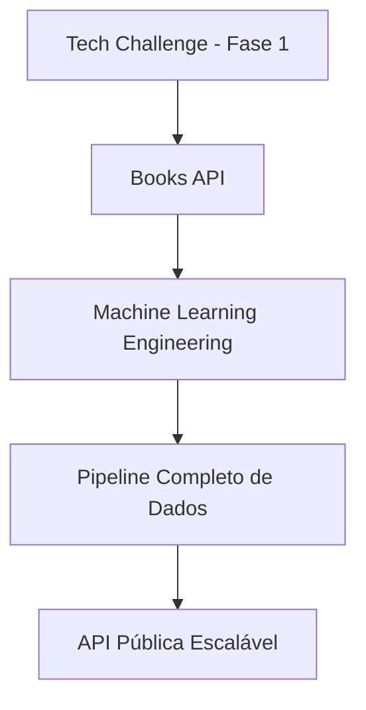
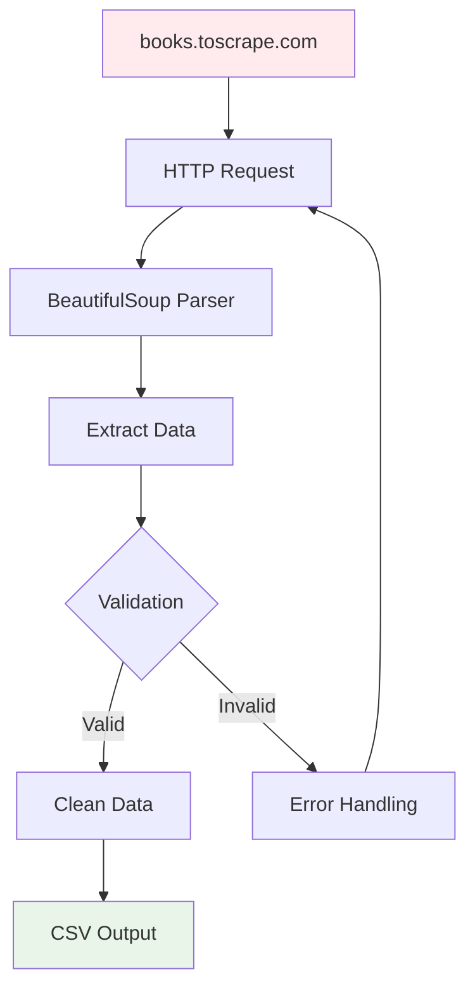
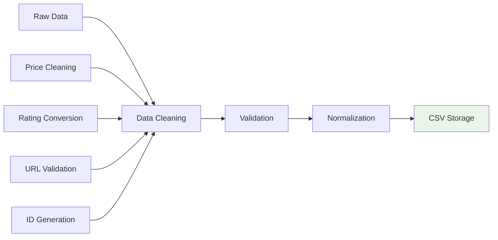
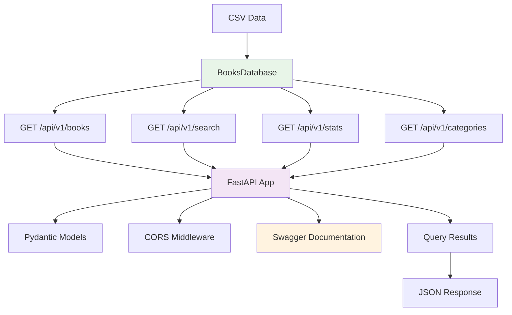
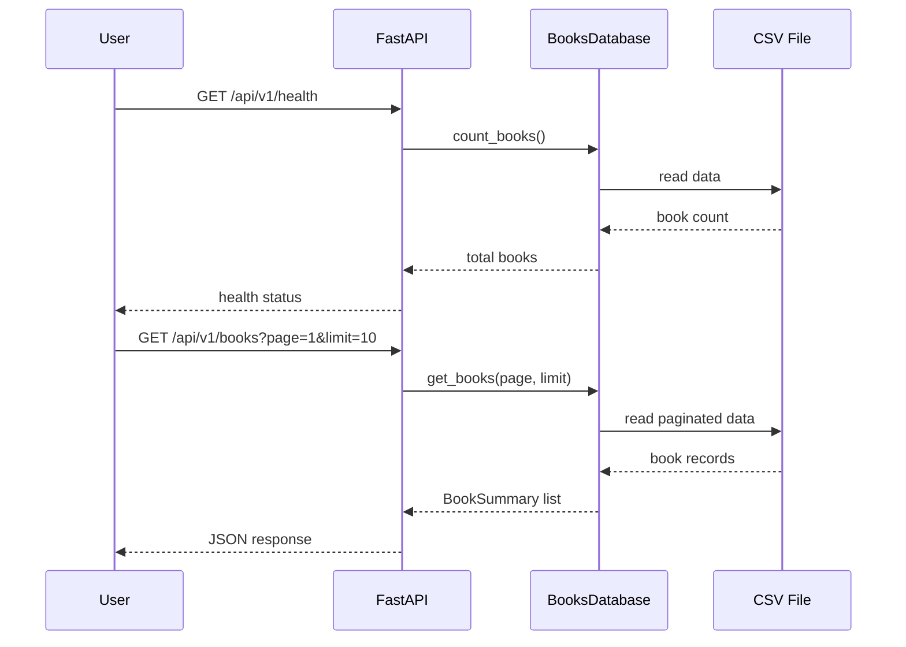
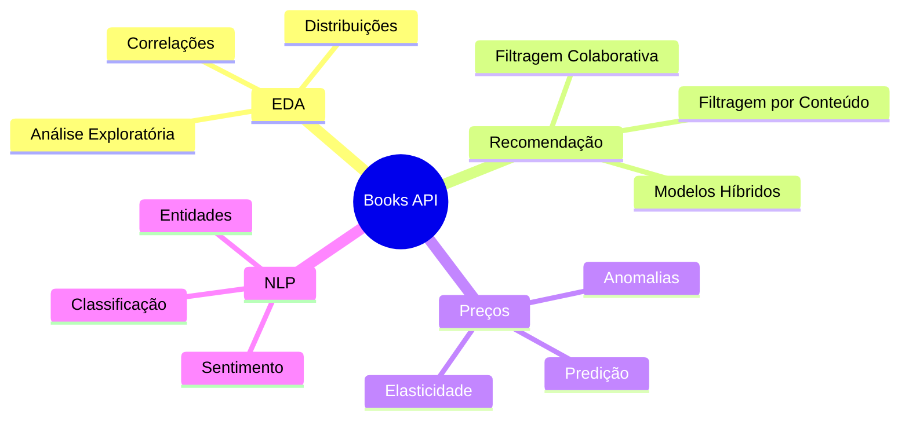
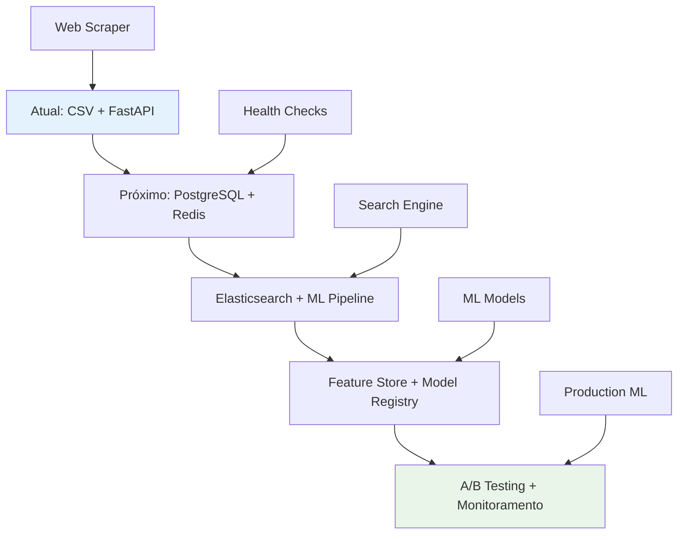
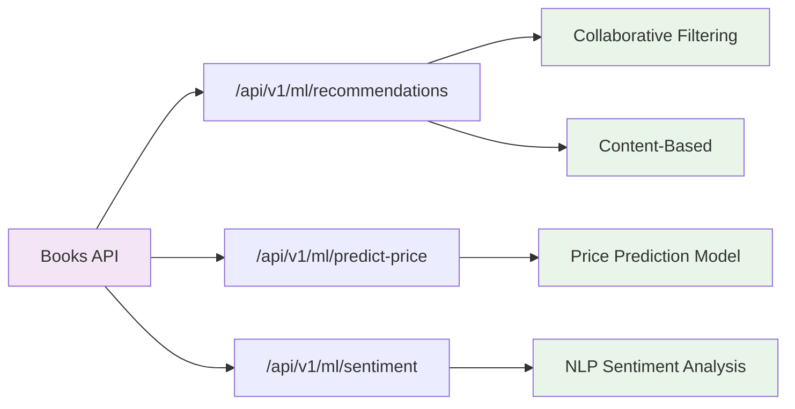
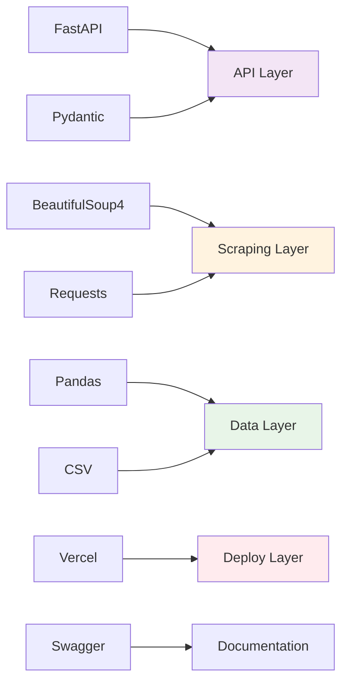
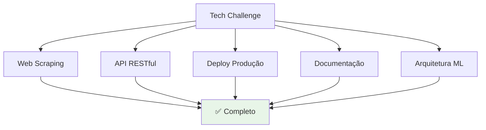

# Script para Vídeo de Apresentação - Books API Tech Challenge

**Aluno**: Guilherme Favaron  
**Tech Challenge - Fase 1 - Machine Learning Engineering**

---

## **INTRODUÇÃO**



> "Olá, eu sou Guilherme Favaron e vou apresentar minha solução para o Tech Challenge da Fase 1 de Machine Learning Engineering. Desenvolvi uma **API pública completa para consulta de livros**, com foco em escalabilidade e integração com modelos de Machine Learning."

**Pontos-chave:**
- Nome do projeto: Tech Challenger 1
- Objetivo: Pipeline completo de dados para ML
- Fonte: Web scraping de books.toscrape.com

---

## **ARQUITETURA E PIPELINE**


> "A arquitetura segue um pipeline bem definido: **Ingestão → Processamento → API → Consumo**. Vou mostrar cada etapa:"

### **1. Ingestão de Dados (Web Scraping)**



**[DEMONSTRAÇÃO: Mostrar código do scraper.py]**

> "Primeiro, desenvolvi um web scraper robusto que extrai dados do books.toscrape.com. O scraper coleta **título, preço, rating, disponibilidade, categoria e imagens** de todos os livros disponíveis."

**Destaques:**
- Tratamento de erros HTTP
- Rate limiting para não sobrecarregar o servidor
- Validação de dados extraídos
- Geração de IDs únicos

### **2. Processamento e Armazenamento**



**[MOSTRAR: Arquivo CSV gerado]**

> "Os dados são processados, limpos e armazenados em formato CSV estruturado. Implementamos validações de qualidade, detecção de duplicatas e normalização de formatos."

### **3. API FastAPI**



**[DEMONSTRAÇÃO: Swagger UI]**

> "A API foi desenvolvida com FastAPI, oferecendo documentação automática, validação de dados com Pydantic e performance assíncrona."

---

## **DEMONSTRAÇÃO PRÁTICA DA API**



**[MOSTRAR: Swagger UI em produção]**

### **Endpoints Core Implementados:**

#### **1. Health Check**
**[EXECUTAR: GET /api/v1/health]**
> "Primeiro, vamos verificar o status da API. Este endpoint mostra que temos X livros carregados e a API está funcionando perfeitamente."

**[MOSTRAR: POSTMAN]**

#### **2. Listagem de Livros**
**[EXECUTAR: GET /api/v1/books?page=1&limit=10]**
> "Aqui temos a listagem paginada dos livros. Notem a estrutura dos dados: ID, título, preço, rating, categoria e disponibilidade."

**[MOSTRAR: POSTMAN]**

#### **3. Busca Inteligente**
**[EXECUTAR: GET /api/v1/books/search?title=light&category=poetry]**
> "A busca permite filtrar por título e categoria simultaneamente. Muito útil para sistemas de recomendação."

**[MOSTRAR: POSTMAN]**

#### **4. Estatísticas para ML**
**[EXECUTAR: GET /api/v1/stats/overview]**
> "Este endpoint fornece dados agregados essenciais para cientistas de dados: preço médio, distribuição de ratings, faixas de preço por categoria."

**[MOSTRAR: POSTMAN]**

#### **5. Categorias Disponíveis**
**[EXECUTAR: GET /api/v1/categories]**
> "Listamos todas as categorias com contagem de livros, fundamental para análises exploratórias."

**[MOSTRAR: POSTMAN]**

---

## **CENÁRIOS DE USO PARA MACHINE LEARNING**



> "Esta API foi pensada especificamente para cientistas de dados. Vou mostrar os principais casos de uso:"

### **1. Análise Exploratória de Dados (EDA)**

A API Books oferece uma base para análise exploratória de dados, permitindo que cientistas de dados extraiam insights sobre o mercado de livros (disponíveis pela API). Com endpoints estruturados que retornam dados limpos e organizados, é possível realizar análises estatísticas sobre preços, ratings, categorias e disponibilidade. A estrutura padronizada dos dados facilita a integração com bibliotecas como Pandas, NumPy e Matplotlib, permitindo visualizações e análises descritivas.

**[MOSTRAR: Código Python]**
```python
import requests
import pandas as pd

# Obter dados completos
response = requests.get('https://tech-challenger-1.vercel.app/api/v1/books?limit=1000')
books_df = pd.DataFrame(response.json())

# Análises possíveis
books_df.groupby('category')['rating'].mean()
books_df['price'].describe()
```

### **2. Sistemas de Recomendação**
> "Os dados estruturados permitem implementar:"
- **Filtragem Colaborativa**: Baseada em ratings similares
- **Filtragem por Conteúdo**: Usando categorias e títulos
- **Modelos Híbridos**: Combinando ambas as abordagens

### **3. Análise de Preços e NLP**
> "Também suporta predição de preços, análise de sentimento em títulos e classificação automática de categorias."

---

## **ESCALABILIDADE E FUTURO**



> "Pensando em escalabilidade, o projeto está preparado para evoluir:"

### **Arquitetura Futura:**
- **Database**: Migração para PostgreSQL + Redis para cache
- **Search**: Elasticsearch para busca textual avançada
- **ML Pipeline**: Feature Store, Model Registry, A/B Testing
- **Monitoramento**: Métricas de performance e model drift

### **Integração com ML:**



> "Planejamos endpoints específicos para ML:"
- `/api/v1/ml/recommendations` - Recomendações personalizadas
- `/api/v1/ml/predict-price` - Predição de preços
- `/api/v1/ml/sentiment` - Análise de sentimento

---

## **ASPECTOS TÉCNICOS E BOAS PRÁTICAS**



### **Stack Tecnológico:**
- **Backend**: FastAPI + Pydantic
- **Scraping**: BeautifulSoup4 + Requests
- **Deploy**: Vercel (Serverless)
- **Dados**: Pandas + CSV
- **Documentação**: Swagger/OpenAPI

### **Boas Práticas Implementadas:**
- **Validação rigorosa** de entrada e saída
- **Tratamento de erros** HTTP e de dados
- **Paginação** para performance
- **CORS** configurado para acesso público
- **Documentação automática** com exemplos
- **Código modular** e bem estruturado

---

## **RESULTADOS E MÉTRICAS**

> "Os resultados alcançados:"
- **1000+ livros** extraídos e processados
- **8 endpoints** funcionais em produção
- **API 100% operacional** no Vercel
- **Documentação completa** com Swagger
- **Código versionado** no GitHub
- **Pipeline automatizado** de dados

---

## **CONCLUSÃO**



> "Entreguei uma solução completa que atende todos os requisitos do Tech Challenge:"

- **Web scraping funcional** e robusto
- **API RESTful completa** com todos os endpoints
- **Deploy em produção** totalmente operacional
- **Documentação técnica** detalhada
- **Plano arquitetural** para escalabilidade
- **Foco em Machine Learning** desde o design

> "A API está pronta para ser consumida por cientistas de dados e pode evoluir facilmente para um sistema de recomendação completo. Obrigado pela atenção!"

---

## **Links Importantes:**
- **API em Produção**: [API LINK](https://tech-challenger-1.vercel.app)
- **Documentação**: [DOCS LINK](https://tech-challenger-1.vercel.app/api/docs)
- **GitHub**: [REPOSITÓRIO](https://github.com/guifav/tech_challenger_1.git)
- **Dataset**: [DATA SET](https://github.com/guifav/tech_challenger_1/blob/main/data/books_data.csv)

---
